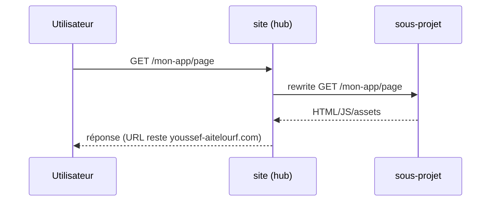
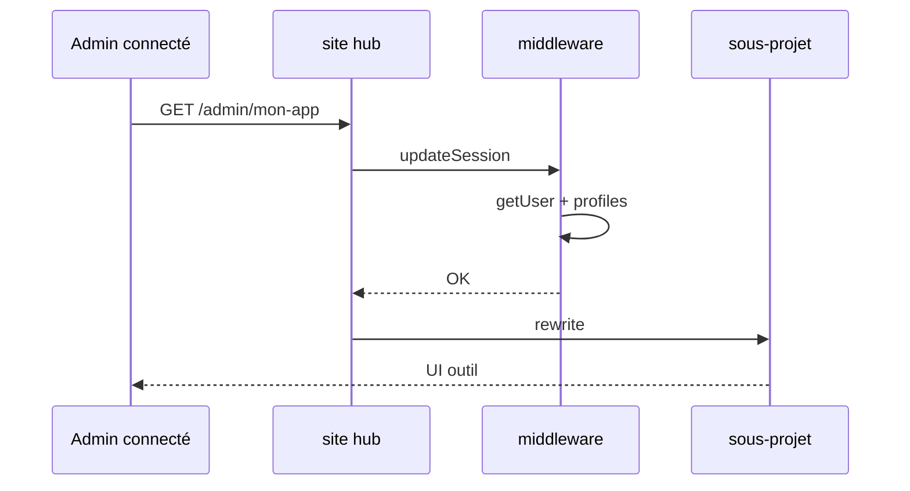

# Contexte — Ajouter une application au hub youssef-aitelourf.com

> **Objectif** : guide **pas à pas et exhaustif** pour intégrer une nouvelle application (ou réactiver une existante) au projet **`site`**, sans casser le portfolio, l’auth admin, ni Supabase.

**Prérequis** : lire **`contexte-appli.md`** en entier (architecture, auth, RLS, infra).

**Dernière mise à jour** : mai 2026

---

## Table des matières

1. [Décision : quel type d’intégration ?](#1-décision--quel-type-dintégration-)
2. [Conventions de nommage](#2-conventions-de-nommage)
3. [Type A — Application publique (proxy)](#3-type-a--application-publique-proxy)
4. [Type B — Application admin protégée (proxy + session)](#4-type-b--application-admin-protégée-proxy--session)
5. [Type C — Pages dans le repo `site`](#5-type-c--pages-dans-le-repo-site)
6. [Auth, rôles et comptes](#6-auth-rôles-et-comptes)
7. [Base de données partagée (Supabase)](#7-base-de-données-partagée-supabase)
8. [Variables d’environnement](#8-variables-denvironnement)
9. [Deployment Protection Vercel](#9-deployment-protection-vercel)
10. [Procédure de déploiement complète](#10-procédure-de-déploiement-complète)
11. [Tests et validation](#11-tests-et-validation)
12. [Exemples réels dans ce monorepo](#12-exemples-réels-dans-ce-monorepo)
13. [Réactivation CV Adapter (walkthrough)](#13-réactivation-cv-adapter-walkthrough)
14. [Pièges, erreurs fréquentes](#14-pièges-erreurs-fréquentes)
15. [Checklist imprimable](#15-checklist-imprimable)
16. [Maintenance documentaire](#16-maintenance-documentaire)

---

## 1. Décision : quel type d’intégration ?

### 1.1 Arbre de décision

```
Nouvelle appli à exposer sur youssef-aitelourf.com
│
├─ Accessible sans login (vitrine, doc publique) ?
│   └─ OUI → TYPE A (rewrite public /mon-app)
│
├─ Réservée aux utilisateurs connectés (outil interne famille) ?
│   ├─ Grosse UI déjà sur Vercel / repo séparé ?
│   │   └─ OUI → TYPE B (rewrite /admin/mon-app + middleware existant)
│   └─ Petit écran / formulaire simple ?
│       └─ OUI → TYPE C (pages dans app/ du repo site)
│
└─ Appli mobile native plus tard ?
    └─ Même Supabase + JWT — voir contexte-appli.md §14
        (le routing web reste A ou B ; l’API mobile est un chantier séparé)
```

### 1.2 Table comparative

| Critère | Type A Public | Type B Admin proxy | Type C Local |
|---------|---------------|-------------------|--------------|
| **Exemple** | portfolio | cv-adapter | futur petit formulaire |
| **Route** | `/mon-app` | `/admin/mon-app` | `/admin/...` dans site |
| **Repo** | Séparé | Séparé | `site` uniquement |
| **basePath** | `/mon-app` | `/admin/mon-app` | N/A |
| **Auth hub** | Non | Oui (middleware) | Oui |
| **Rewrite Vercel** | Oui | Oui | Non |
| **Complexité** | Moyenne | Élevée | Faible |
| **Quand choisir** | Site public | Outil métier lourd | UI minimale |

---

## 2. Conventions de nommage

### 2.1 Slug de route

| Règle | Exemple bon | Exemple mauvais |
|-------|-------------|-----------------|
| kebab-case | `cv-adapter`, `budget-tool` | `CvAdapter`, `budget_tool` |
| court, explicite | `docs`, `portfolio` | `app`, `tool` |
| pas de slash | `mon-app` | `mon/app` |
| cohérent partout | même slug dans basePath, rewrites, liens | `cv-adapter` vs `cvadapter` |

### 2.2 Alignement obligatoire (les 4 doivent matcher)

```
1. Route publique sur le hub     →  /mon-app  ou  /admin/mon-app
2. basePath du sous-projet Next   →  /mon-app  ou  /admin/mon-app
3. Rewrites source dans site     →  /mon-app  (+ /mon-app/:path*)
4. destination rewrite suffix    →  ...vercel.app/mon-app/...
```

**Erreur classique** : `basePath: "/mon-app"` mais rewrite vers `...vercel.app/` sans le préfixe → 404.

### 2.3 Nom projet Vercel / repo GitHub

Recommandation :

- Repo : `mon-app` ou `mon-app-frontend`
- Projet Vercel : même nom
- Ne **pas** lier le domaine `youssef-aitelourf.com` au sous-projet

### 2.4 Username (si comptes dédiés à l’outil)

Les users se connectent au **hub**, pas au sous-projet :

- Création via `/admin/users` (super_admin)
- Le sous-projet peut lire le JWT/session si tu implémentes un partage de cookie plus tard — **hors scope par défaut** (le sous-projet est servi en rewrite, même origine `youssef-aitelourf.com` → cookies partagés automatiquement)

---

## 3. Type A — Application publique (proxy)

### 3.1 Vue d’ensemble

Le visiteur accède à `https://youssef-aitelourf.com/mon-app`.  
Vercel **site** proxy vers le sous-projet sans vérifier de session.



### 3.2 Étape 1 — Préparer le sous-projet

#### 3.2.1 Créer le repo et déployer sur Vercel

1. Repo GitHub sous `youssef-aitelourf/...`
2. Import Vercel → équipe `youssef-ait-elourfs-projects`
3. Framework : Next.js (ou autre — Next documenté ici)
4. **Ne pas** assigner de domaine custom

#### 3.2.2 Configurer `basePath`

```ts
// next.config.ts DU SOUS-PROJET
import type { NextConfig } from "next";

const nextConfig: NextConfig = {
  basePath: "/mon-app",
  // assetPrefix: "/mon-app"  // en général pas nécessaire si basePath seul
};

export default nextConfig;
```

#### 3.2.3 Vérifier en direct (AVANT de toucher au hub)

```bash
# Remplacer par l’URL stable du projet
curl -sI "https://MON-PROJET-youssef-ait-elourfs-projects.vercel.app/mon-app" | head -3
# Attendu: HTTP/2 200

curl -sI "https://MON-PROJET-youssef-ait-elourfs-projects.vercel.app/mon-app/autre-page" | head -3
# Selon les routes de l’appli
```

Si **404** : corriger le sous-projet avant d’avancer.

#### 3.2.4 Désactiver Deployment Protection

Voir [§9](#9-deployment-protection-vercel).

### 3.3 Étape 2 — Modifier le hub (`site`)

#### 3.3.1 `next.config.ts`

```ts
const MON_APP_URL =
  process.env.MON_APP_URL ??
  "https://mon-projet-youssef-ait-elourfs-projects.vercel.app";

// Dans async rewrites(), AJOUTER (ne pas supprimer portfolio existant) :
{ source: "/mon-app", destination: `${MON_APP_URL}/mon-app` },
{ source: "/mon-app/:path*", destination: `${MON_APP_URL}/mon-app/:path*` },
```

**Pourquoi deux lignes ?**  
Sur Vercel/Next, le pattern `/:path*` **ne matche pas** la route exacte `/mon-app` sans segment supplémentaire.

#### 3.3.2 `vercel.json` (optionnel mais recommandé pour la CI)

Dupliquer les mêmes entrées dans `rewrites` pour que la CI reste verte :

```json
{
  "source": "/mon-app",
  "destination": "https://mon-projet-youssef-ait-elourfs-projects.vercel.app/mon-app"
},
{
  "source": "/mon-app/:path*",
  "destination": "https://mon-projet-youssef-ait-elourfs-projects.vercel.app/mon-app/:path*"
}
```

#### 3.3.3 Redirect racine (optionnel)

Si la nouvelle appli **remplace** le portfolio en page d’accueil :

```ts
// redirects — ATTENTION impact majeur
{ source: "/", destination: "/mon-app", permanent: true },
```

Sinon laisser `/` → `/portfolio`.

### 3.4 Étape 3 — Tester localement le hub

```bash
cd site
# .env.local avec SUPABASE_* si tu testes aussi l’admin
npm run dev
```

Ouvrir `http://localhost:3000/mon-app` — le rewrite pointe vers la **prod** du sous-projet (pas localhost du sous-projet sauf si tu changes l’URL).

### 3.5 Étape 4 — Déployer

```bash
git checkout -b feat/add-mon-app
git add next.config.ts vercel.json contexte-appli.md
git commit -m "feat: proxy /mon-app vers sous-projet XYZ"
git push -u origin feat/add-mon-app
# PR ou push main selon ton flux
```

Attendre build Vercel **site** (~25 s).

### 3.6 Étape 5 — Validation prod

```bash
curl -sI "https://youssef-aitelourf.com/mon-app" | head -5
```

Checklist complète : [§11](#11-tests-et-validation).

---

## 4. Type B — Application admin protégée (proxy + session)

### 4.1 Vue d’ensemble

L’utilisateur doit être **connecté au hub** (cookie Supabase).  
Le middleware existant protège déjà `/admin` et `/admin/:path*`.



### 4.2 Étape 1 — Sous-projet (comme Type A mais basePath admin)

```ts
// next.config.ts DU SOUS-PROJET
const nextConfig: NextConfig = {
  basePath: "/admin/mon-app",
};
export default nextConfig;
```

Vérification directe :

```bash
curl -sI "https://MON-PROJET-youssef-ait-elourfs-projects.vercel.app/admin/mon-app"
```

### 4.3 Étape 2 — Rewrites dans `site/next.config.ts`

```ts
const MON_APP_URL =
  process.env.MON_APP_URL ??
  "https://mon-projet-youssef-ait-elourfs-projects.vercel.app";

// rewrites:
{ source: "/admin/mon-app", destination: `${MON_APP_URL}/admin/mon-app` },
{ source: "/admin/mon-app/:path*", destination: `${MON_APP_URL}/admin/mon-app/:path*` },
```

### 4.4 Étape 3 — Retirer les redirects « désactivé »

Si l’appli était coupée (cas cv-adapter), **supprimer** de `redirects` :

```ts
// À SUPPRIMER pour réactiver
{ source: "/admin/mon-app", destination: "/admin", permanent: false },
{ source: "/admin/mon-app/:path*", destination: "/admin", permanent: false },
```

### 4.5 Étape 4 — Lien dans le hub admin

`app/admin/page.tsx` — ajouter un lien (exemple) :

```tsx
{["super_admin", "admin", "member"].includes(profile?.role ?? "") && (
  <Link href="/admin/mon-app" className="...">
    Mon application
  </Link>
)}
```

Affiner les rôles autorisés selon le besoin métier.

### 4.6 Étape 5 — (Recommandé) Garde de rôle dans le middleware

Fichier : `lib/supabase/middleware.ts`  
Après le bloc `profile.active` et avant le check `/admin/users` :

```ts
if (pathname.startsWith("/admin/mon-app")) {
  const allowed: string[] = ["super_admin", "admin", "member"];
  if (!allowed.includes(profile.role)) {
    return NextResponse.redirect(new URL("/admin", request.url));
  }
}
```

**Pourquoi ?** Le rewrite enverrait quand même la requête si on ne garde que « être connecté » — toute personne avec un compte `member` pourrait accéder. Ajuste `allowed` selon la sensibilité de l’outil.

### 4.7 Étape 6 — Variable d’environnement (optionnelle)

Sur Vercel projet **site** :

| Variable | Exemple |
|----------|---------|
| `MON_APP_URL` | `https://mon-projet-youssef-ait-elourfs-projects.vercel.app` |

Permet de changer l’URL sans redéployer le code (changer env + redeploy).

### 4.8 Cookies et même origine

Les rewrites Vercel servent le sous-projet sous `youssef-aitelourf.com` → **même site** pour le navigateur :

- Cookies session Supabase posés par le hub sont visibles
- Le sous-projet peut appeler `/api/auth` du hub si besoin

Si le sous-projet fait des `fetch` vers des APIs sur son propre domaine `*.vercel.app` → **CORS** possible. Préférer APIs relatives `/api/...` sur le hub ou routes dans le sous-projet proxifié.

### 4.9 Auth côté sous-projet (avancé, optionnel)

Par défaut **non requis** : le hub fait la barrière.  
Si tu veux une double vérification dans le sous-projet :

- Lire le cookie Supabase (même `@supabase/ssr`)
- Mêmes env `SUPABASE_URL` / `ANON_KEY` sur le sous-projet Vercel

---

## 5. Type C — Pages dans le repo `site`

### 5.1 Quand l’utiliser

- Formulaire simple, liste, config
- Pas de build séparé
- Logique étroitement couplée au hub

### 5.2 Étapes

1. Créer `app/admin/mon-app/page.tsx` (Server ou Client Component)
2. Protégé automatiquement : matcher middleware `/admin/:path*`
3. Utiliser `getProfile()` / `hasRole()` depuis `lib/auth.ts`
4. Données : `createClient()` serveur ou `createAdminClient()` si bypass RLS nécessaire

Exemple squelette :

```tsx
// app/admin/mon-app/page.tsx
import { redirect } from "next/navigation";
import { hasRole } from "@/lib/auth";

export default async function MonAppPage() {
  if (!(await hasRole(["super_admin", "admin"]))) {
    redirect("/admin");
  }
  return <main>...</main>;
}
```

### 5.3 Pas de rewrite

Rien à ajouter dans `next.config.ts` pour le proxy.

---

## 6. Auth, rôles et comptes

### 6.1 Qui peut se connecter ?

- Tout user avec une ligne `profiles` + `active=true` + identifiants Supabase Auth
- Login : **username** ou **email** (voir `lib/login.ts`)

### 6.2 Créer un compte pour accéder à l’outil

1. Se connecter en **super_admin**
2. Aller sur `/admin/users`
3. Remplir :
   - **Username** (obligatoire) — utilisé pour la connexion
   - **Email** (optionnel) — sinon `username@accounts.youssef-aitelourf.com`
   - **Mot de passe temporaire** (min 8 caractères)
   - **Rôle** : `member` pour famille, `admin` pour confiance élevée

### 6.3 API création (référence)

`POST /api/admin/users`

```json
{
  "username": "pierre",
  "email": "pierre@example.com",
  "password": "temporaire123",
  "role": "member"
}
```

Réponses :

| Code | Signification |
|------|----------------|
| 200 | `{ ok: true, id: "<uuid>" }` |
| 400 | validation / username pris |
| 401 | pas connecté |
| 403 | pas super_admin |

### 6.4 Désactiver un compte

**Pas encore d’UI** — via Supabase SQL ou Dashboard :

```sql
UPDATE public.profiles SET active = false WHERE username = 'pierre';
```

Le middleware déconnectera l’user au prochain hit (`error=inactive`).

### 6.5 Matrice rôles → routes (à étendre par appli)

| Route | super_admin | admin | member |
|-------|-------------|-------|--------|
| `/admin` | ✓ | ✓ | ✓ |
| `/admin/users` | ✓ | ✗ | ✗ |
| `/admin/mon-app` (exemple) | ✓* | ✓* | ✓* |

\* Ajuster dans middleware selon politique.

---

## 7. Base de données partagée (Supabase)

### 7.1 Même projet pour hub + données métier

Projet : **Site-Youssef** (`pcickkvgqjweqxqliwno`)

Avantages :

- Un seul login pour web + future mobile
- Foreign keys vers `auth.users`

### 7.2 Créer une migration

```bash
cd site
supabase migration new mon_app_tables
# Éditer supabase/migrations/<timestamp>_mon_app_tables.sql
supabase db push
```

Exemple minimal :

```sql
CREATE TABLE public.mon_app_items (
  id uuid PRIMARY KEY DEFAULT gen_random_uuid(),
  user_id uuid NOT NULL REFERENCES auth.users (id) ON DELETE CASCADE,
  title text NOT NULL,
  created_at timestamptz NOT NULL DEFAULT now()
);

ALTER TABLE public.mon_app_items ENABLE ROW LEVEL SECURITY;

CREATE POLICY mon_app_items_select_own
  ON public.mon_app_items FOR SELECT TO authenticated
  USING (auth.uid() = user_id);

CREATE POLICY mon_app_items_insert_own
  ON public.mon_app_items FOR INSERT TO authenticated
  WITH CHECK (auth.uid() = user_id);
```

### 7.3 Règles RLS à respecter

| À faire | À éviter |
|---------|----------|
| `auth.uid() = user_id` | `EXISTS (SELECT 1 FROM profiles WHERE ...)` dans policy sur `profiles` |
| `SECURITY DEFINER` functions simples | Policies qui relisent la même table récursivement |
| Admin listing via `service_role` | Donner service_role au client |

Référence bug historique : migrations 004–005 dans `contexte-appli.md`.

### 7.4 Accès depuis le sous-projet proxifié

Option 1 — API routes dans **site** (`/api/mon-app/...`)  
Option 2 — Server Actions dans **site**  
Option 3 — Même Supabase env sur sous-projet (duplication config)

---

## 8. Variables d'environnement

### 8.1 Projet Vercel `site`

| Variable | Type A | Type B | Description |
|----------|--------|--------|-------------|
| `SUPABASE_URL` | — | — | Toujours requis (auth) |
| `SUPABASE_ANON_KEY` | — | — | Idem |
| `SUPABASE_SERVICE_ROLE_KEY` | — | — | Idem |
| `MON_APP_URL` | Optionnel | Recommandé | URL stable du sous-projet |

### 8.2 Projet Vercel sous-projet

| Variable | Notes |
|----------|-------|
| Secrets métier de l’appli | OpenAI, DB externe, etc. |
| `SUPABASE_*` | Seulement si le sous-projet accède directement à Supabase |

### 8.3 Local

Ajouter dans `.env.local` du hub si rewrite avec URL custom :

```bash
MON_APP_URL=https://mon-projet-youssef-ait-elourfs-projects.vercel.app
```

---

## 9. Deployment Protection Vercel

### 9.1 Symptôme

- `curl https://sous-projet-...vercel.app/mon-app` → **200**
- `curl https://youssef-aitelourf.com/mon-app` → **401** ou page login Vercel

### 9.2 Cause

**Vercel Authentication** (Deployment Protection / SSO) activée sur le **sous-projet**, pas sur `site`.

### 9.3 Fix (Dashboard)

1. [vercel.com](https://vercel.com) → projet **sous-projet**
2. Settings → **Deployment Protection**
3. Désactiver pour Production (et Preview si tu testes des previews)

### 9.4 Fix (API)

```bash
# Récupérer PROJECT_ID du sous-projet via vercel project inspect <name>
curl -X PATCH "https://api.vercel.com/v9/projects/<PROJECT_ID>?teamId=team_folYzpvs2nNSQkAi6gVVg2xi" \
  -H "Authorization: Bearer $VERCEL_TOKEN" \
  -H "Content-Type: application/json" \
  -d '{"ssoProtection": null}'
```

---

## 10. Procédure de déploiement complète

### 10.1 Timeline recommandée

| Jour / phase | Action |
|--------------|--------|
| 1 | Sous-projet : basePath, deploy, test URL stable, SSO off |
| 2 | Hub : rewrites, liens admin, middleware rôles, migrations SQL |
| 3 | Push main, tests prod, mise à jour docs |
| 4 | Création comptes famille, communication identifiants |

### 10.2 Ordre strict (ne pas inverser)

```
1. Sous-projet OK en direct
2. SSO désactivé sur sous-projet
3. Rewrites dans site
4. (Si Type B) Retrait redirects + lien admin + middleware rôles
5. (Si SQL) supabase db push
6. git push → Vercel site
7. Tests automatisés + manuels §11
8. Mise à jour contexte-appli.md (table des apps actives)
```

### 10.3 Rollback rapide

Pour **désactiver** une appli sans supprimer le sous-projet :

```ts
// next.config.ts — remplacer rewrites par redirects
{ source: "/admin/mon-app", destination: "/admin", permanent: false },
{ source: "/admin/mon-app/:path*", destination: "/admin", permanent: false },
```

Push → l’outil n’est plus accessible via le domaine (comme cv-adapter aujourd’hui).

---

## 11. Tests et validation

### 11.1 Script bash de smoke test

```bash
BASE="https://youssef-aitelourf.com"

echo "=== Public ==="
curl -s -o /dev/null -w "/ → %{http_code}\n" -L --max-redirs 0 "$BASE/"
curl -s -o /dev/null -w "/portfolio → %{http_code}\n" "$BASE/portfolio"
curl -s -o /dev/null -w "/mon-app → %{http_code}\n" "$BASE/mon-app"

echo "=== Admin sans auth ==="
curl -s -o /dev/null -w "/admin → %{http_code}\n" -L --max-redirs 0 "$BASE/admin"
curl -s -o /dev/null -w "/admin/login → %{http_code}\n" "$BASE/admin/login"

echo "=== Login ==="
curl -s -c /tmp/cj -X POST "$BASE/api/auth" \
  -H "Content-Type: application/json" \
  -d '{"identifier":"admin","password":"VOTRE_MDP"}'
echo ""
curl -s -o /dev/null -w "/admin (cookie) → %{http_code}\n" -b /tmp/cj "$BASE/admin"
curl -s -o /dev/null -w "/admin/mon-app (cookie) → %{http_code}\n" -b /tmp/cj "$BASE/admin/mon-app"
```

### 11.2 Table des résultats attendus

| Test | Attendu |
|------|---------|
| `/` | 308 → `/portfolio` |
| `/portfolio` | 200 |
| `/admin` sans cookie | 307 → `/admin/login` |
| `POST /api/auth` bon identifiant | 200 + Set-Cookie |
| `POST /api/auth` mauvais | 401 |
| `/admin` avec cookie | 200 |
| `/admin/users` non super_admin | redirect `/admin` |
| `/admin/mon-app` Type B | 200 (si rôle OK) |
| Sous-projet direct | 200 |

### 11.3 Tests navigateur manuels

- [ ] Login avec **username**
- [ ] Login avec **email**
- [ ] Logout → retour login
- [ ] Navigation portfolio : liens internes, assets CSS
- [ ] Outil admin : actions principales
- [ ] Mobile responsive (si pertinent)

---

## 12. Exemples réels dans ce monorepo

### 12.1 Portfolio (Type A — **ACTIF**)

| Champ | Valeur |
|-------|--------|
| Slug | `portfolio` |
| Repo | `youssef-aitelourf/portfolio-2` |
| Projet Vercel | `portfolio-2` |
| basePath | `/portfolio` |
| URL stable | `portfolio-2-youssef-ait-elourfs-projects.vercel.app` |
| Fichiers hub | `next.config.ts` rewrites, `vercel.json` |
| Redirect `/` | → `/portfolio` |

### 12.2 CV Adapter (Type B — **DÉSACTIVÉ**, modèle)

| Champ | Valeur |
|-------|--------|
| Slug | `cv-adapter` (route admin) |
| Repo | `cv-adapter-ML-model` |
| Projet Vercel | `cv-adapter` |
| basePath sous-projet | `/admin/cv-adapter` |
| URL stable | `cv-adapter-youssef-ait-elourfs-projects.vercel.app` |
| État hub | redirects vers `/admin` ou `/portfolio` — **pas de rewrite** |

---

## 13. Réactivation CV Adapter (walkthrough)

Checklist concrète pour réactiver l’existant :

### 13.1 Sous-projet

- [ ] Vérifier `frontend-next/next.config.ts` : `basePath: "/admin/cv-adapter"`
- [ ] Deploy récent OK
- [ ] `curl -I https://cv-adapter-youssef-ait-elourfs-projects.vercel.app/admin/cv-adapter` → 200
- [ ] Deployment Protection **off**

### 13.2 Hub `next.config.ts`

- [ ] **Supprimer** redirects cv-adapter (lignes `/cv-adapter`, `/admin/cv-adapter`)
- [ ] **Ajouter** rewrites :

```ts
const CV_ADAPTER_URL =
  process.env.CV_ADAPTER_URL ??
  "https://cv-adapter-youssef-ait-elourfs-projects.vercel.app";

{ source: "/admin/cv-adapter", destination: `${CV_ADAPTER_URL}/admin/cv-adapter` },
{ source: "/admin/cv-adapter/:path*", destination: `${CV_ADAPTER_URL}/admin/cv-adapter/:path*` },
```

- [ ] Env Vercel `CV_ADAPTER_URL` (optionnel)

### 13.3 UI

- [ ] `app/admin/page.tsx` — remettre lien vers `/admin/cv-adapter`
- [ ] Middleware — rôles autorisés si besoin

### 13.4 Deploy & test

- [ ] push main
- [ ] Login admin → clic CV Adapter → UI charge

---

## 14. Pièges, erreurs fréquentes

### 14.1 Table de diagnostic

| Symptôme | Cause probable | Action |
|----------|----------------|--------|
| 404 sur route proxifiée | basePath ≠ rewrite path | Aligner §2.2 |
| 404 uniquement sur `/mon-app` sans slash | Manque rewrite sans `/:path*` | Ajouter 2 rewrites |
| 401 via hub, 200 en direct | Deployment Protection | §9 |
| Assets CSS cassés | basePath incorrect | Fix sous-projet |
| Login OK, `/admin` KO `inactive` | RLS profiles récursif | Migrations 005 |
| Login OK, `?error=profile` | Pas de ligne profiles | Trigger / seed |
| Username login fail | `profiles.username` null | UPDATE username |
| CI verte mais routing cassé | vercel.json désync | Sync avec next.config |
| `npm run build` OK local, fail Vercel | Env manquantes | Dashboard Vercel |
| API admin créée sans middleware | Normal | Vérif dans handler |

### 14.2 Ne jamais utiliser ces URLs en rewrite

```
❌ https://portfolio-2-flax-iota.vercel.app
❌ https://site-2vfl3zwak-youssef-ait-elourfs-projects.vercel.app
✅ https://portfolio-2-youssef-ait-elourfs-projects.vercel.app
```

Les URLs avec hash de déploiement changent à chaque build.

### 14.3 Confusion domaine

Le domaine `youssef-aitelourf.com` doit être attaché **uniquement** au projet **`site`**.

---

## 15. Checklist imprimable

### Nouvelle appli — copier/coller

```
PLANIFICATION
[ ] Type A / B / C choisi
[ ] Slug défini : _______________
[ ] Rôles autorisés listés : _______________

SOUS-PROJET (si A ou B)
[ ] Repo GitHub créé : _______________
[ ] Projet Vercel créé (sans domaine custom)
[ ] basePath = _______________
[ ] Test URL stable direct → 200
[ ] Deployment Protection désactivée

HUB (site)
[ ] 2 rewrites ajoutés dans next.config.ts
[ ] vercel.json sync (CI)
[ ] Redirects "off" retirés (Type B)
[ ] Lien dans app/admin/page.tsx (Type B/C)
[ ] Middleware rôles (si besoin)
[ ] MON_APP_URL sur Vercel (optionnel)

SUPABASE (si données)
[ ] Migration créée : _______________
[ ] supabase db push
[ ] RLS testée (pas de récursion)

AUTH
[ ] Comptes créés pour testeurs
[ ] Test login username + email

DEPLOY
[ ] git push main
[ ] Vercel site Ready
[ ] Smoke tests §11 OK

DOC
[ ] contexte-appli.md mis à jour
[ ] contexte-ajout-appli.md (exemple ajouté si utile)
```

---

## 16. Maintenance documentaire

Après **chaque** nouvelle application :

1. **`contexte-appli.md`**
   - §2 inventaire Vercel (nouvelle ligne)
   - §4 table des routes
   - §10 ou §11 sous-projets
   - §14 évolutions si besoin

2. **`contexte-ajout-appli.md`**
   - §12 exemple réel (nouvelle sous-section)

3. **`CLAUDE.md`** (optionnel)
   - Table « Active projects » si encore utilisé par des agents

4. **Commit message suggéré**

```
feat: add proxy /mon-app to XYZ (Type A|B)

- Rewrites in next.config.ts + vercel.json
- Docs: contexte-appli.md
```

---

*Fin du guide — en cas de doute, tester le sous-projet en direct avant de modifier le hub.*
