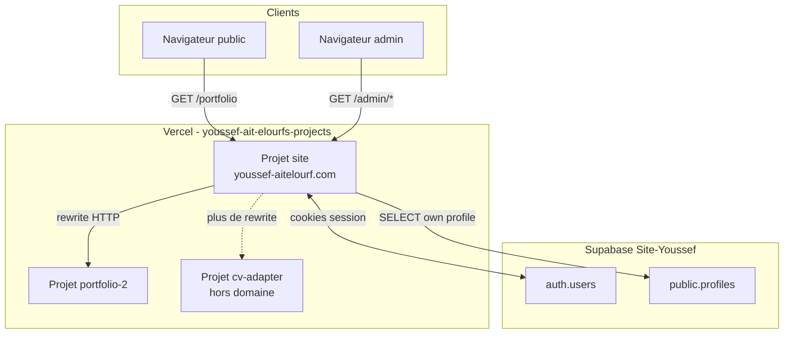

# Contexte application — Hub `site` (youssef-aitelourf.com)

> **Objectif de ce document** : permettre à toi (ou à un agent IA / un nouveau dev) de **reprendre le projet sans ambiguïté** — architecture, fichiers, flux, infra, auth, pièges connus, commandes exactes.

**Documents liés** :

- `contexte-ajout-appli.md` — comment brancher une nouvelle application
- `docs/AUTH.md` — setup Supabase pas à pas (version courte)
- `CLAUDE.md` — notes historiques routing (partiellement obsolète : le repo est devenu une app Next.js complète)

**Dernière mise à jour** : mai 2026

---

## Table des matières

1. [Résumé exécutif](#1-résumé-exécutif)
2. [Inventaire infrastructure](#2-inventaire-infrastructure)
3. [Architecture et flux](#3-architecture-et-flux)
4. [Routing HTTP exhaustif](#4-routing-http-exhaustif)
5. [Repository `site` — arborescence commentée](#5-repository-site--arborescence-commentée)
6. [Authentification Supabase (détail)](#6-authentification-supabase-détail)
7. [Base de données et migrations](#7-base-de-données-et-migrations)
8. [Déploiement, Git, CI](#8-déploiement-git-ci)
9. [Développement local](#9-développement-local)
10. [Sous-projets Vercel](#10-sous-projets-vercel)
11. [CV Adapter (historique et état)](#11-cv-adapter-historique-et-état)
12. [Sécurité](#12-sécurité)
13. [Dépannage](#13-dépannage)
14. [Évolutions prévues](#14-évolutions-prévues)
15. [Glossaire](#15-glossaire)

---

## 1. Résumé exécutif

### Ce que fait le projet

Le repo **`site`** est déployé sur Vercel et possède le **domaine custom** `youssef-aitelourf.com`.

Il remplit **trois rôles** :

1. **Reverse proxy** vers des applications hébergées sur **d’autres projets Vercel** (ex. le portfolio sur `/portfolio`).
2. **Portail d’administration** : login, hub `/admin`, gestion des comptes famille (`/admin/users`).
3. **Point d’ancrage auth** pour des outils futurs (même projet Supabase, sessions cookie, rôles).

### Ce que ce projet n’est PAS

- Ce n’est **pas** le code source du portfolio (c’est `portfolio-2`).
- Ce n’est **pas** une SPA monolithique avec tout le contenu métier — la majorité du trafic public est **proxifié**.

### État fonctionnel actuel (mai 2026)

| Fonctionnalité | Statut |
|----------------|--------|
| Domaine `youssef-aitelourf.com` → projet `site` | OK |
| Portfolio `/portfolio` | OK (proxy) |
| Login admin (username **ou** email) | OK |
| Gestion users (`super_admin`) | OK |
| CV Adapter sur le domaine | **Désactivé** (redirects) |
| Appli mobile / API dédiée | **Pas encore** |

---

## 2. Inventaire infrastructure

### 2.1 Comptes et équipes

| Élément | Valeur |
|---------|--------|
| **GitHub** | `youssef-aitelourf/site` |
| **Vercel team** | `youssef-ait-elourfs-projects` (Youssef AIT ELOURF's projects) |
| **Vercel user CLI** | `youssefaitelourfpro-7181` |
| **Supabase org** | lié au compte créé sur supabase.com |
| **Projet Supabase** | **Site-Youssef** |
| **Project ref** | `pcickkvgqjweqxqliwno` |
| **URL API Supabase** | `https://pcickkvgqjweqxqliwno.supabase.co` |
| **Région Supabase** | West EU (Ireland) |

### 2.2 Projets Vercel (liste complète connue)

| Projet Vercel | Rôle | Production URL (type) | Domaine custom | Node |
|---------------|------|-------------------------|----------------|------|
| **site** | Hub + admin | `youssef-aitelourf.com` | **Oui** | 24.x |
| **portfolio-2** | Portfolio | `portfolio-2-flax-iota.vercel.app` (+ alias stable) | Non | 24.x |
| **cv-adapter** | Outil CV | `cv-adapter-mu.vercel.app` (+ alias stable) | Non | 24.x |

**URL stables pour rewrites** (à utiliser dans `next.config.ts`, jamais les URLs de déploiement éphémères `site-xxxxx`) :

```
portfolio-2-youssef-ait-elourfs-projects.vercel.app
cv-adapter-youssef-ait-elourfs-projects.vercel.app
```

**ID projet Vercel `site`** (pour API / dashboard) : `prj_s4y7NvSxMOyJaXEj6bt7CmsYVpsA`

**Team ID** (mentionné dans `CLAUDE.md` pour API protection) : `team_folYzpvs2nNSQkAi6gVVg2xi`

### 2.3 Variables d’environnement — projet Vercel `site`

| Variable | Obligatoire | Où | Description |
|----------|-------------|-----|-------------|
| `SUPABASE_URL` | Oui | Production (+ Preview recommandé) | URL du projet Supabase |
| `SUPABASE_ANON_KEY` | Oui | Idem | Clé publique (RLS appliqué) |
| `SUPABASE_SERVICE_ROLE_KEY` | Oui | Idem, **serveur uniquement** | Bypass RLS — création users, résolution username |
| `CV_ADAPTER_URL` | Non | Obsolète si présent | Ancien proxy cv-adapter — peut être supprimé |
| `ADMIN_USERNAME` / `ADMIN_PASSWORD` | Non | **À supprimer** | Ancien système env — remplacé par Supabase |

`next.config.ts` recopie vers le client :

```ts
env: {
  NEXT_PUBLIC_SUPABASE_URL: process.env.SUPABASE_URL,
  NEXT_PUBLIC_SUPABASE_ANON_KEY: process.env.SUPABASE_ANON_KEY,
},
```

### 2.4 Fichiers locaux sensibles (ne jamais committer)

| Fichier | Contenu |
|---------|---------|
| `.env.local` | Clés Supabase + `SEED_*` pour scripts |
| `.vercel/` | Lien projet Vercel (généré par `vercel link`) |

`.gitignore` inclut `.env.local`, `.vercel`, `node_modules`, `.next`.

---

## 3. Architecture et flux

### 3.1 Diagramme global



### 3.2 Flux visiteur public (portfolio)

```
1. GET https://youssef-aitelourf.com/
2. Next/Vercel redirect 308 → /portfolio
3. Rewrite (site) → https://portfolio-2-...vercel.app/portfolio
4. Réponse HTML/JS/assets du projet portfolio-2 (basePath /portfolio)
5. L’utilisateur voit toujours youssef-aitelourf.com/portfolio dans la barre d’adresse
```

**Point important** : le portfolio doit être buildé avec `basePath: "/portfolio"` sinon les assets (CSS, JS) ont des chemins incorrects.

### 3.3 Flux login admin

```
1. GET /admin/login (public, pas de middleware auth bloquant)
2. Utilisateur saisit identifiant (username OU email) + mot de passe
3. POST /api/auth  { identifier, password }
4. serveur: resolveLoginEmail(identifier)
      - si contient @ → email direct
      - sinon → lookup profiles.username (service_role) → email
5. supabase.auth.signInWithPassword({ email, password })
6. Cookie sb-<ref>-auth-token posé (httpOnly, SameSite=lax)
7. Client: router.push(from) + router.refresh()
8. GET /admin → middleware:
      - getUser() OK
      - SELECT profiles WHERE id = user.id (RLS: own row)
      - active=true → page hub
```

### 3.4 Flux création compte (super_admin)

```
1. super_admin connecté → GET /admin/users
2. Formulaire: username, email (opt), password, role
3. POST /api/admin/users
4. Vérifications: session + role super_admin
5. email = email fourni OU username@accounts.youssef-aitelourf.com
6. admin.auth.createUser (service_role)
7. Trigger DB crée profile role=member
8. UPDATE profiles SET role, username, email, created_by, active
9. refresh liste users (service_role lit toute la table)
```

### 3.5 Ordre d’exécution middleware vs rewrites

- **Middleware** (`middleware.ts`) : matcher `["/admin", "/admin/:path*"]` uniquement — **pas** sur `/portfolio`, `/api` (sauf routes sous `/admin`).
- **`/api/auth`** : public (liste `PUBLIC_PATHS` dans `lib/supabase/middleware.ts`).
- **`/api/admin/users`** : pas dans PUBLIC_PATHS mais le matcher `/admin/:path*` ne couvre **pas** `/api/admin/*` — cette route n’est **pas** protégée par le middleware Next !

**⚠️ Nuance de sécurité** : la protection de `POST /api/admin/users` est **dans le handler** (vérif session + super_admin), pas dans le middleware. Ne pas se fier au middleware pour cette route.

---

## 4. Routing HTTP exhaustif

### 4.1 Table des routes — production attendue

| Méthode | Chemin | Auth | Comportement | Config |
|---------|--------|------|--------------|--------|
| GET | `/` | Non | 308 → `/portfolio` | `next.config` redirects |
| GET | `/portfolio` | Non | Proxy portfolio | rewrite |
| GET | `/portfolio/*` | Non | Proxy portfolio | rewrite |
| GET | `/cv-adapter` | Non | 307/308 → `/portfolio` | redirect (désactivé) |
| GET | `/cv-adapter/*` | Non | → `/portfolio` | redirect |
| GET | `/admin/login` | Non | Page login | app |
| POST | `/api/auth` | Non | Login | route handler |
| DELETE | `/api/auth` | Cookie | Logout | route handler |
| GET | `/admin` | Oui | Hub admin | app + middleware |
| GET | `/admin/users` | super_admin | Liste users | app + middleware |
| POST | `/api/admin/users` | super_admin* | Créer user | handler *vérif interne |
| GET | `/admin/cv-adapter` | — | → `/admin` | redirect |
| GET | `/admin/cv-adapter/*` | — | → `/admin` | redirect |

### 4.2 `next.config.ts` (source de vérité routing)

Fichier actuel — à garder synchronisé lors de changements :

```ts
const PORTFOLIO_URL = "https://portfolio-2-youssef-ait-elourfs-projects.vercel.app";

// redirects: /, cv-adapter*, admin/cv-adapter*
// rewrites: /portfolio, /portfolio/:path*
// env: NEXT_PUBLIC_SUPABASE_*
```

### 4.3 `vercel.json` (doublon partiel)

Contient encore redirects `/` → `/portfolio` et rewrites portfolio **identiques** à `next.config.ts`.

- La **CI GitHub** valide uniquement `vercel.json` (pas `next.config.ts`).
- Risque : désynchronisation si on modifie un seul fichier.
- **Recommandation future** : étendre la CI ou supprimer le doublon.

### 4.4 Paramètres query login

| Param | Signification |
|-------|----------------|
| `from` | URL de retour après login (ex. `/admin/users`) |
| `error=inactive` | Compte `profiles.active = false` |
| `error=profile` | Ligne `profiles` introuvable ou erreur RLS |

---

## 5. Repository `site` — arborescence commentée

```
site/
├── app/
│   ├── layout.tsx              # Layout racine App Router
│   ├── globals.css               # Styles Tailwind globaux
│   ├── admin/
│   │   ├── page.tsx              # Server Component — hub, lien users si super_admin
│   │   ├── logout-button.tsx     # Client — fetch DELETE /api/auth
│   │   ├── login/
│   │   │   └── page.tsx          # Client — formulaire identifier + password
│   │   └── users/
│   │       ├── page.tsx          # Server — liste profiles (admin client)
│   │       └── create-user-form.tsx  # Client — POST /api/admin/users
│   └── api/
│       ├── auth/
│       │   └── route.ts          # POST login, DELETE logout
│       └── admin/
│           └── users/
│               └── route.ts      # POST création compte
├── lib/
│   ├── auth.ts                   # getSession, getProfile, hasRole
│   ├── login.ts                  # resolveLoginEmail, username rules
│   └── supabase/
│       ├── client.ts             # createBrowserClient (rarement utilisé)
│       ├── server.ts             # createServerClient + cookies next/headers
│       ├── middleware.ts         # updateSession — cœur garde /admin
│       └── admin.ts              # createAdminClient (SERVICE_ROLE)
├── middleware.ts                 # matcher /admin → updateSession
├── next.config.ts                # redirects, rewrites, env public Supabase
├── vercel.json                   # doublon routing + CI
├── supabase/
│   ├── config.toml               # généré par supabase init
│   └── migrations/001…006.sql
├── scripts/
│   └── seed-super-admin.mjs      # premier super_admin
├── docs/AUTH.md
├── contexte-appli.md             # ce fichier
├── contexte-ajout-appli.md
├── CLAUDE.md                     # notes (partiellement obsolète)
├── .github/workflows/ci.yml
├── package.json
├── tailwind.config.ts
├── postcss.config.mjs
├── tsconfig.json                 # paths "@/*" → "./*"
└── .env.local.example
```

### 5.1 Dépendances npm (versions indicatives)

| Package | Usage |
|---------|--------|
| `next` ^16.2.6 | Framework |
| `react` / `react-dom` ^19 | UI |
| `@supabase/supabase-js` | Client Supabase |
| `@supabase/ssr` | Cookies session App Router + middleware |

### 5.2 Scripts npm

```bash
npm run dev          # next dev — nécessite .env.local
npm run build        # next build
npm run start        # next start (prod local)
npm run lint         # eslint next
npm run seed:admin   # node scripts/seed-super-admin.mjs
```

---

## 6. Authentification Supabase (détail)

### 6.1 Pourquoi Supabase Auth (et pas env vars)

Historique :

1. **v1** : `ADMIN_USERNAME` / `ADMIN_PASSWORD` en variables Vercel + cookie `admin_session=1` (booléen).
2. **v2 (actuel)** : vrais comptes, plusieurs users, rôles, username — projet **Site-Youssef**.

Supabase stocke les mots de passe (hash). Le hub ne stocke **jamais** de mot de passe en clair.

### 6.2 Identifiant de connexion

| Entrée utilisateur | Traitement |
|--------------------|------------|
| `admin@domain.com` | Utilisé tel quel comme email Auth |
| `admin` | `profiles.username` → `profiles.email` → signIn |

Règles username (`lib/login.ts`) :

- Regex : `^[a-z0-9_-]{3,32}$` après `toLowerCase()`
- Unicité : index unique `lower(username)` en base

Email interne si pas d’email à la création :

```
{username}@accounts.youssef-aitelourf.com
```

### 6.3 Rôles

| Rôle | `profiles.role` | Capacités |
|------|-----------------|-----------|
| Super admin | `super_admin` | `/admin`, `/admin/users`, création comptes, tous rôles assignables |
| Admin | `admin` | `/admin` (hub), outils futurs selon middleware |
| Member | `member` | Idem admin pour l’instant — affiner par outil plus tard |

**Pas d’inscription publique** : aucune page `/signup`.

### 6.4 Cookies session

- Nom typique : `sb-pcickkvgqjweqxqliwno-auth-token` (peut être chunké si gros).
- Posés par `@supabase/ssr` lors du `signInWithPassword` dans `/api/auth`.
- Rafraîchis dans `updateSession` (middleware).

### 6.5 Fichier par fichier — auth

#### `lib/supabase/middleware.ts`

- Crée un client Supabase lié aux cookies de la **requête** entrante.
- `getUser()` — valide le JWT côté Supabase (pas seulement decode local).
- Chemins publics : `/admin/login`, `/api/auth` (prefix match).
- Si pas de user → redirect login + `from`.
- Charge `profiles` (role, active) — **RLS : uniquement sa propre ligne**.
- Si erreur profil → `?error=profile` (souvent RLS ou ligne manquante).
- Si `active=false` → signOut + `?error=inactive`.
- Si `/admin/users` et role ≠ super_admin → redirect `/admin`.

#### `middleware.ts` (racine)

```ts
export const config = {
  matcher: ["/admin", "/admin/:path*"],
};
```

Ne protège **pas** `/portfolio` ni `/api/admin/*`.

#### `app/api/auth/route.ts`

- Accepte `{ identifier, password }` ou legacy `{ email, password }`.
- `resolveLoginEmail` puis `signInWithPassword`.
- Erreur générique : `{ error: "Identifiants invalides" }` (401) — pas de distinction user/password pour limiter l’énumération.

#### `lib/supabase/admin.ts`

- `createClient(url, SERVICE_ROLE_KEY)`.
- **Uniquement** importer depuis Route Handlers ou Server Actions — **jamais** depuis `"use client"`.

#### `lib/auth.ts`

- `getProfile()` : retourne null si pas de user ou `active=false`.
- Utilisé par les Server Components (`admin/page.tsx`).

### 6.6 Compte super_admin initial

Créé via :

```bash
# .env.local : SUPABASE_URL, SUPABASE_SERVICE_ROLE_KEY, SEED_EMAIL, SEED_PASSWORD, SEED_USERNAME
npm run seed:admin
```

Le script :

1. `auth.admin.createUser` (ou retrouve user existant par email)
2. Trigger crée `profiles` role `member`
3. `UPDATE profiles` → `super_admin`, `username`, `active`, `email`

Migration `006` a aussi backfill `username='admin'` pour l’email `admin@youssef-aitelourf.com`.

---

## 7. Base de données et migrations

### 7.1 Schéma `public.profiles` (état final)

| Colonne | Type | Notes |
|---------|------|-------|
| `id` | uuid PK | = `auth.users.id`, ON DELETE CASCADE |
| `role` | text | CHECK IN super_admin, admin, member |
| `active` | boolean | default true |
| `created_at` | timestamptz | |
| `created_by` | uuid nullable | FK auth.users |
| `email` | text nullable | copie / sync pour affichage |
| `username` | text nullable | unique via index `lower(username)` |

### 7.2 Trigger `on_auth_user_created`

À chaque insert dans `auth.users` :

- Insère une ligne `profiles` avec `role='member'` (+ email si migration 003+).

Les flows admin **écrasent** ensuite role/username via `UPDATE`.

### 7.3 RLS — état actuel (critique)

**Policy active pour les users normaux** :

- `profiles_select_own` : `auth.uid() = id`

**Policies supprimées (migration 005)** :

- `profiles_select_super_admin` — causait **récursion infinie** (`42P17`) car la policy relisait `profiles` dans une sous-requête.

**Conséquence** :

- Un user connecté ne voit **que sa** ligne via client anon/authenticated.
- La **liste complète** des users sur `/admin/users` utilise **`createAdminClient()`** (bypass RLS).

**Fonction `is_super_admin()`** (migration 002) : existe encore, SECURITY DEFINER — utilisable pour futures policies **sans** sous-requête récursive sur `profiles`.

### 7.4 Liste des migrations (ordre strict)

| # | Fichier | Contenu |
|---|---------|---------|
| 001 | `001_profiles.sql` | Table, trigger signup, RLS own + super_admin (récursif) |
| 002 | `002_is_super_admin.sql` | Fonction helper |
| 003 | `003_profiles_email_and_admin_policies.sql` | Colonne email, update policies |
| 004 | `004_fix_profiles_rls_recursion.sql` | Tentative fix via is_super_admin |
| 005 | `005_profiles_rls_own_row_only.sql` | **Suppression** policies super_admin récursives |
| 006 | `006_profiles_username.sql` | Colonne username, index, backfill admin |

Commande apply :

```bash
cd site
supabase link --project-ref pcickkvgqjweqxqliwno
supabase db push
```

### 7.5 Tables futures (appli mobile)

Même projet Supabase recommandé :

- Nouvelles tables avec `user_id uuid REFERENCES auth.users`
- RLS : `auth.uid() = user_id`
- Pas de référence circulaire à `profiles` dans les policies

---

## 8. Déploiement, Git, CI

### 8.1 Flux Git actuel (pratique réelle)

- Travail souvent **direct sur `main`** (GitHub peut bypass les règles de branche).
- Doc historique : PR `dev` → `main` — la branche `dev` peut être **en retard** (ancienne version sans admin Next).

### 8.2 Déclenchement Vercel

```
git push origin main  →  build Vercel projet site  →  alias youssef-aitelourf.com
```

Durée build typique : **~25 s**.

### 8.3 CI GitHub (`.github/workflows/ci.yml`)

**Déclencheurs** :

- `push` sur `dev`
- `pull_request` vers `main`

**Action** : valide que `vercel.json` est du JSON valide avec clés `rewrites` et `redirects`, et que chaque rewrite a `source` + `destination`.

**Ce que la CI ne fait PAS** :

- `npm run build`
- Tests e2e
- Validation `next.config.ts`
- Lint TypeScript

### 8.4 Aliases Vercel connus (site)

Exemples (peuvent varier) :

- `youssef-aitelourf.com`
- `site-tau-nine-85.vercel.app`
- `site-youssef-ait-elourfs-projects.vercel.app`
- `site-git-main-youssef-ait-elourfs-projects.vercel.app` (preview branche main)

### 8.5 Commandes opérationnelles

```bash
# Déploiements
vercel ls site
vercel inspect youssef-aitelourf.com

# Env (après vercel link dans le repo)
vercel env ls

# Supabase
supabase projects list
supabase migration list
supabase db push
```

---

## 9. Développement local

### 9.1 Prérequis

- Node.js 20+ (Vercel utilise 24)
- npm
- Compte Supabase + CLI (`brew install supabase/tap/supabase`)
- Optionnel : Vercel CLI (`brew install vercel`)

### 9.2 Setup initial

```bash
git clone https://github.com/youssef-aitelourf/site.git
cd site
npm install
cp .env.local.example .env.local
# Remplir SUPABASE_* et SEED_*
supabase login
supabase link --project-ref pcickkvgqjweqxqliwno
supabase db push   # si migrations pas encore appliquées
npm run seed:admin # si pas de super_admin
vercel link        # optionnel
npm run dev
```

Ouvrir : `http://localhost:3000/admin/login`

**Note** : les rewrites `/portfolio` fonctionnent en local — ils proxy vers la prod portfolio Vercel (pas le localhost portfolio).

### 9.3 Tests manuels rapides

```bash
# Login API
curl -X POST http://localhost:3000/api/auth \
  -H "Content-Type: application/json" \
  -d '{"identifier":"admin","password":"TON_MDP"}' -c cookies.txt

# Admin avec cookie
curl -b cookies.txt http://localhost:3000/admin -I
```

---

## 10. Sous-projets Vercel

### 10.1 portfolio-2

| | |
|---|---|
| **Repo GitHub** | `youssef-aitelourf/portfolio-2` |
| **Route hub** | `/portfolio` |
| **basePath** | `/portfolio` |
| **URL stable** | `https://portfolio-2-youssef-ait-elourfs-projects.vercel.app` |

**Checklist santé** :

```bash
curl -sI https://portfolio-2-youssef-ait-elourfs-projects.vercel.app/portfolio | head -5
curl -sI https://youssef-aitelourf.com/portfolio | head -5
# Les deux doivent être 200
```

### 10.2 Exigence Deployment Protection

Si le portfolio renvoie **401** via le hub mais **200** en direct :

→ Désactiver **Vercel Authentication / Deployment Protection** sur le projet `portfolio-2`.

Patch API (si token Vercel) — voir `CLAUDE.md` :

```bash
curl -X PATCH "https://api.vercel.com/v9/projects/<PROJECT_ID>?teamId=team_folYzpvs2nNSQkAi6gVVg2xi" \
  -H "Authorization: Bearer $VERCEL_TOKEN" \
  -H "Content-Type: application/json" \
  -d '{"ssoProtection": null}'
```

---

## 11. CV Adapter (historique et état)

### 11.1 Historique

- Outil hébergé sur projet Vercel **cv-adapter**
- Repo : `cv-adapter-ML-model` (frontend Next avec `basePath: "/admin/cv-adapter"`)
- Était proxifié derrière auth hub sur `/admin/cv-adapter`
- **Désactivé** volontairement (commit `de226ba`) : redirects au lieu de rewrites

### 11.2 État actuel des routes

```
/cv-adapter          → redirect /portfolio
/admin/cv-adapter    → redirect /admin
```

### 11.3 Réactivation

Voir **`contexte-ajout-appli.md`** section « Type B » et exemple CV Adapter.

---

## 12. Sécurité

### 12.1 Bonnes pratiques en place

- Mots de passe hashés par Supabase Auth
- Cookies httpOnly pour session
- `SERVICE_ROLE_KEY` uniquement côté serveur
- RLS sur `profiles` pour accès self
- Routes admin API vérifient le rôle dans le handler

### 12.2 Points d’attention

| Risque | Mitigation |
|--------|------------|
| Fuite `SERVICE_ROLE_KEY` | Jamais dans client, `.env.local` gitignored |
| `/api/admin/users` hors middleware | Vérif manuelle dans handler — ne pas retirer |
| Énumération users | Messages d’erreur login génériques |
| Username interne email | Domaine `accounts.youssef-aitelourf.com` — pas un vrai boîte mail |
| Doublon vercel.json / next.config | Risque de routing incohérent — tester après modif |

### 12.3 Rotation des clés

Si une clé est exposée (chat, commit accidentel) :

1. Régénérer dans Supabase Dashboard → Settings → API
2. Mettre à jour Vercel env + `.env.local`
3. Redéployer `site`

---

## 13. Dépannage

### 13.1 Login : « Identifiants invalides »

| Cause | Vérification |
|-------|--------------|
| Mauvais mot de passe | Tester via Supabase Dashboard → Authentication → Users |
| Username inconnu | `profiles.username` renseigné ? |
| Env Vercel incorrect | `SUPABASE_URL` / `ANON_KEY` du bon projet ? |
| Email interne | User créé sans email → login avec **username** |

### 13.2 Login OK mais redirect « Compte désactivé » / inactive

Souvent **profil illisible** (pas vraiment inactive) :

- Bug RLS récursif (avant migration 005) — appliquer migrations 004+005.
- Vérifier ligne dans `profiles` pour `auth.users.id`.

### 13.3 Login OK mais `?error=profile`

- Pas de ligne `profiles` → vérifier trigger `on_auth_user_created`
- Erreur RLS → voir §7.3

### 13.4 Portfolio 404 ou sans style

- `basePath` incorrect sur portfolio-2
- Rewrite manquant pour `/portfolio` sans wildcard
- URL destination = déploiement éphémère au lieu de l’URL stable

### 13.5 Portfolio 401 via hub seulement

- Deployment Protection sur portfolio-2

### 13.6 Build Vercel échoue

- Variables `SUPABASE_*` manquantes en production
- `npm run build` local avec env factices pour reproduire

---

## 14. Évolutions prévues

- [ ] Appli mobile / API REST avec JWT Supabase
- [ ] Tables métier + RLS dans même projet Supabase
- [ ] Réactivation ou remplacement CV Adapter
- [ ] Rate limiting sur `/api/auth`
- [ ] Reset password par email (SMTP / Resend)
- [ ] CI : `npm run build` + lint
- [ ] Fusionner routing uniquement dans `next.config.ts`
- [ ] Middleware ou matcher pour `/api/admin/*` (défense en profondeur)
- [ ] Page changement de mot de passe self-service

---

## 15. Glossaire

| Terme | Définition |
|-------|------------|
| **Hub** | Projet `site` sur Vercel, possède le domaine |
| **Sous-projet** | Autre projet Vercel proxifié (portfolio, cv-adapter) |
| **Rewrite** | Vercel/Next proxy : URL publique inchangée, contenu d’un autre backend |
| **basePath** | Préfixe de routes dans une app Next déployée (ex. `/portfolio`) |
| **RLS** | Row Level Security — Postgres filtre les lignes par utilisateur |
| **service_role** | Clé Supabase qui bypass RLS — serveur uniquement |
| **URL stable** | `*-youssef-ait-elourfs-projects.vercel.app` |

---

*Fin du document — maintenir à jour après chaque changement d’architecture, migration ou nouvelle appli.*
